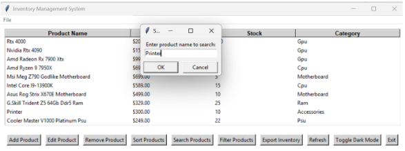
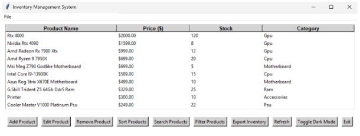

## Program Description
The program involves developing an inventory tracking system tailored for a tech company. It will include login/logout functionality, enabling users to view stored raw or sorted data and interact with the inventory by editing, deleting, adding, and viewing products. The system will not involve purchasing but will provide essential features for employees and administrators.

## Step-by-step run through for each UI component

### Main Menu
Where you'll choose to either login as an admin or view as a customer

### Customer View
Customer view has limited functionality compared to admin view, cannot edit or add anything to product database

### Logout
If user wants to change from customer view to admin view or vice versa

### Admin View
Admins can only be logged in by using student numbers for now. Students numbers can be seen in **data.csv**

### Dark Mode
User can choose if they want to have their software in dark mode, click dark mode again to go back to light mode

### Add Product
User can add product to database, software will prompt you to fill in products name, price, stock, and category

### Edit Product
User can edit specific product by providing software with desired products name with the new price and stock

### Remove Product
User can remove product by selecting specific product on list and press **yes** to confirmation window to remove from database

### Sort Products
User can sort products by specifying what they want to sort by and if they want it in ascending or descending order

### Search Product
User can search for a specific product by giving software the products name

### Refresh
User can refresh screen to original list of products after searching or filtering

### Filter Products
User can filter products by specifying what category they want to see (example below shows GPU products)

### Export Inventory
User can export all changed products from database to new exported csv to share or show clients

